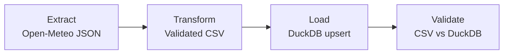
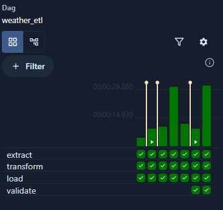
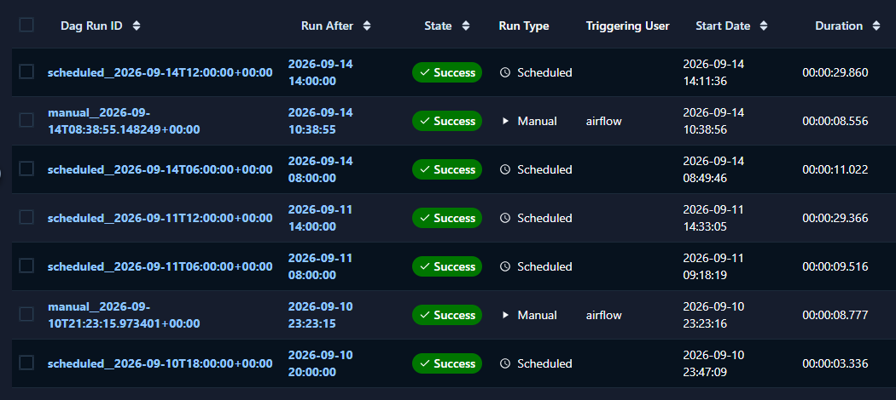

# Weather ETL with Apache Airflow

A local learning project by Davide Cocchia, based on the [DataSkew Airflow project](https://dataskew.io/projects/orchestration-airflow/).

The pipeline retrieves hourly weather forecasts for Milan from Open-Meteo, validates and normalizes the response, loads it into DuckDB, and reconciles the loaded values against the transformed CSV.

## Architecture

The `weather_etl` DAG runs four tasks in sequence:

| Task | Responsibility | Output |
|---|---|---|
| `extract` | Request forecasts for Milan (45.46, 9.19) | Raw JSON |
| `transform` | Validate units, UTC offset, timestamps and numeric values | Normalized CSV |
| `load` | Insert or update forecasts in a transaction | DuckDB `weather_hourly` table |
| `validate` | Reconcile each CSV row with the database | Validated row count or an exception |



Airflow uses CeleryExecutor, Redis as its broker, and PostgreSQL for orchestration metadata. DuckDB is a separate database containing the weather data.

Files are shared through local bind mounts. XCom passes file paths and row counts rather than entire datasets. Each DAG run has its own directory under `data/runs/`.

## Runtime

| Component | Version used |
|---|---|
| Apache Airflow | 3.3.1 |
| Custom image | `orchestration-airflow:3.3.1-duckdb1.5.5` |
| DuckDB | 1.5.5 |
| Python used during development | 3.13.14 |
| PostgreSQL image | `postgres:16` |
| Redis image | `redis:7.2-bookworm` |

Development and verification were performed on Windows with PowerShell, VS Code and Docker Desktop using WSL 2. PostgreSQL and Redis tags track their respective release lines; they are not image-digest pins.

## Prerequisites

### Foundational knowledge

- Basic terminal use: open PowerShell, navigate between folders with `cd`, run commands, and read output and error messages.
- Basic Python: variables, functions, imports, collections, and exceptions.
- Basic SQL: `SELECT`, `INSERT`, primary keys, and the purpose of transactions.
- Familiarity with JSON, CSV, and the extract-transform-load workflow.
- Basic Git concepts: clone, stage, commit, and push. Staging and committing can also be performed through VS Code's Source Control interface.

Prior Airflow experience is not required: orchestration, task dependencies, scheduling, and retries are learning objectives of this project.

### Software and resources

- Git.
- Docker Desktop running Linux containers through WSL 2.
- Python 3.13 for local tests and the setup key-generation command.
- PowerShell; VS Code is the editor used during development.
- Internet access to download images and packages and request Open-Meteo forecasts.

The Compose initialization checks for at least 4 GB of Docker memory and recommends at least 2 CPUs and 10 GB of disk space.

## Setup on Windows

Run the commands below in PowerShell. After cloning, use the repository root (the folder containing `docker-compose.yaml`) as the working directory unless stated otherwise.

Python code for the Airflow tasks runs inside Docker; the local `.venv` is used for automated tests.

### 1. Clone and configure

```powershell
git clone https://github.com/Davideco89/orchestration-airflow.git
cd orchestration-airflow
Copy-Item .env.example .env
```

Generate a Fernet key directly into the new local `.env` file:

```powershell
py -3.13 -c "import base64, secrets; from pathlib import Path; p = Path('.env'); key = base64.urlsafe_b64encode(secrets.token_bytes(32)).decode(); p.write_text(p.read_text(encoding='utf-8').replace('FERNET_KEY=', 'FERNET_KEY=' + key, 1), encoding='utf-8')"
```

Run this only once on a fresh copy of `.env.example`. When resuming an existing installation, retain its `.env` and key.

Create local mount directories:

```powershell
New-Item -ItemType Directory -Force -Path dags,logs,plugins,config,data,src | Out-Null
```

### 2. Build and initialize

```powershell
docker compose build
docker compose up airflow-init
```

Wait for initialization to complete successfully with exit code 0. The initialization service prepares the metadata database, creates the initial user and generates the local Airflow configuration if missing.

### 3. Start Airflow

```powershell
docker compose up -d
docker compose ps
```

Seven runtime services are expected: PostgreSQL, Redis, API server, scheduler, DAG processor, worker and triggerer. `airflow-init` is a one-time service and is expected to exit successfully. Flower and the CLI helper use optional profiles.

Open [Airflow](http://localhost:8080). The default local credentials are `airflow` / `airflow`.

This Compose stack is for local learning. It retains development defaults for database credentials and JWT authentication and publishes port 8080. Do not expose it as a production deployment.

### 4. Execute the pipeline

New DAGs are paused by default. Enable `weather_etl` in the UI and trigger a manual run. Verify that `extract`, `transform`, `load` and `validate` all succeed.

The validation log reports the number of CSV rows reconciled against DuckDB. A successful one-day forecast run processes 24 hourly rows; the database can contain more rows as additional days are loaded.

## Scheduling and data semantics

- Introductory DAG: `hello_airflow` runs every five minutes with `*/5 * * * *`.
- Weather DAG: `weather_etl` runs every six hours in UTC with `0 */6 * * *`.
- `catchup=False`; this project does not implement historical backfills.
- `max_active_runs=1` prevents overlapping runs of the weather DAG.
- Each weather task has two retries with a 30-second delay: up to three attempts.
- The request uses `forecast_days=1` and `timezone=UTC`.

Each extraction requests forecasts for the current UTC calendar day at execution time. The data is forecast output, not measured observations. Re-running an older logical run later does not retrieve forecasts for that older interval.

The warehouse key is `(city, forecast_time_utc)`. Repeated loads update the three weather values without creating duplicate keys. The table retains the latest loaded values for each key, not a full history of forecast revisions. Run-specific JSON and CSV files provide local input snapshots; retries within the same run reuse its paths.

The scheduler requires the PC and containers to be running. Actual execution can occur after the scheduled time when the environment has been offline.

## Data quality and loading

Transformation checks:

- UTC offset and expected units: ISO 8601, Celsius, percent and millimetres.
- Hourly fields are lists, timestamps are non-empty, and list lengths match.
- Timestamps are parseable and unique after UTC normalization.
- Weather values are finite numbers, excluding booleans.
- Humidity is between 0 and 100; precipitation is non-negative.

All input rows are validated before writing the CSV. Loading uses an explicit transaction and `ON CONFLICT DO UPDATE`; a failed batch is rolled back.

Post-load validation checks that every CSV key exists and its three values match with relative and absolute tolerances of `1e-9`. It does not require the entire warehouse to have the same row count as the current CSV, and does not independently verify forecast accuracy.

## Error handling and observability

The pipeline fails explicitly when an invalid or inconsistent condition is detected:

- `extract` propagates HTTP and network errors instead of producing incomplete data.
- `transform` rejects unexpected units, invalid timestamps, duplicate timestamps, non-finite values, humidity outside `0–100`, negative precipitation, and empty datasets.
- `load` runs inside a DuckDB transaction and executes `ROLLBACK` if an error occurs.
- `validate` raises an error when a CSV row is missing from DuckDB or when stored values do not match the transformed source.
- Airflow retries failed weather tasks twice, with a 30-second delay between attempts.
- `log_task_failure` is configured as the failure callback for the weather DAG and records a structured `WEATHER_TASK_FAILURE` message containing the DAG, task, run, and exception details.
- `test_failure` is an intentionally failing DAG used to verify retries and callback behaviour without altering the production weather DAG.

The `on_failure_callback` mechanism is implemented and verified: when a task fails, Airflow invokes `log_task_failure`, which writes structured failure details to the task logs. The integration with an external alerting service is intentionally conceptual and outside the scope of this local learning project. No email, Slack message, webhook, or other external notification is configured or triggered.

## Automated tests

From the repository root, prepare a local environment:

```powershell
py -3.13 -m venv .venv
.\.venv\Scripts\python.exe -m pip install -r requirements.txt
.\.venv\Scripts\python.exe -m unittest discover -s tests -v
```

The suite uses Python's built-in `unittest`. Airflow and a notebook kernel are not needed for these tests.

**Verified result during development: 14 tests passed.**

| Test module | Tests | Coverage |
|---|---:|---|
| `test_load_validate.py` | 6 | Loading and reconciliation, repeated loads, updates, rollback, missing rows, mismatched values |
| `test_transform.py` | 8 | Valid CSV output, units, UTC offset, empty data, unequal array lengths, duplicate timestamps, invalid numbers, invalid ranges |

Tests create and clean up temporary files and databases. They do not call the API or modify the project's weather database. They cover transformation, loading and reconciliation; they are not an automated test of the full Docker stack or live API.

Additional manual checks completed during development:

- `hello_airflow` completed its Bash and Python tasks and was configured to run every five minutes.
- `weather_etl` completed both manual and scheduled runs with `extract`, `transform`, `load`, and `validate` successful.
- `test_failure` made three attempts and ended in the expected Failed state.
- The failure callback emitted `WEATHER_TASK_FAILURE` with DAG, task, run, and exception details.
- The DAG processor reported no import errors.

The DAG import check can be repeated with:

```powershell
docker compose exec airflow-dag-processor airflow dags list-import-errors
```

A healthy result is `No data found`, meaning that no DAG import errors were recorded.

## Airflow execution evidence

### Successful task executions

The Airflow UI shows successful executions of all four pipeline tasks: `extract`, `transform`, `load`, and `validate`.



### Manual and scheduled runs

The DAG completed successfully through both manual triggers and its six-hour UTC schedule.



## Repository contents

| Path | Purpose |
|---|---|
| `dags/` | Weather pipeline, introductory DAG and intentional failure DAG |
| `src/` | Extraction, transformation, loading, reconciliation and callback functions |
| `tests/` | Reproducible local tests |
| `docs/images/` | Airflow UI evidence for task execution and DAG runs |
| `Dockerfile` | Extend the Airflow image with DuckDB |
| `docker-compose.yaml` | Local orchestration stack and shared mounts |
| `requirements.txt` | Additional Python dependency pin |
| `.env.example` | Configuration template without a Fernet key |
| `.gitignore` | Exclude local secrets, data, logs, environment and exploratory notebooks |
| `.dockerignore` | Exclude local artifacts from the image build context |
| `LICENSE` | Apache License 2.0 for this repository |

Generated warehouse: `data/weather.duckdb` on the host, mounted at `/opt/airflow/data/weather.duckdb` in the containers. Local `config/airflow.cfg` is generated during initialization and is not committed.

## Stop, resume and troubleshoot

```powershell
docker compose stop
docker compose up -d
```

`stop` preserves containers and data. Avoid deleting the PostgreSQL volume when intending only to pause work.

If a new DAG does not appear immediately, allow time for parsing and refresh the UI. Check the files and processor logs if it remains absent:

```powershell
docker compose exec airflow-dag-processor ls -l /opt/airflow/dags
docker compose logs --tail 100 airflow-dag-processor
```

Local VS Code import warnings about Airflow can occur because Airflow is installed inside Docker rather than the local test environment. Runtime import errors in the DAG processor still require investigation.

The VS Code `.env` terminal-injection notification concerns the Python extension. Compose loads the project's `.env` separately.

## Implementation decisions

| Decision | Reason |
|---|---|
| Airflow 3.3.1 and its API server / DAG processor layout | Use the installed Airflow version and its `airflow.sdk` DAG interface |
| Milan and one UTC forecast day | Keep the first pipeline small and its timestamp semantics explicit |
| DuckDB warehouse, PostgreSQL metadata | Separate analytical data from Airflow's operational state |
| Shared files between tasks | Keep raw inputs inspectable and XCom payloads small in a single-machine setup |
| Custom Docker image | Install DuckDB at build time rather than on each container startup |
| Explicit reconciliation task | Detect missing or altered values after loading |
| Log-based failure callback | Demonstrate error handling without an external messaging service |
| Temporary test fixtures | Make tests reproducible without committing generated databases or calling live services |

The single-machine mounts and serialized weather DAG suit this learning setup. They are not a distributed storage or multi-writer design. dbt integration and external notifications are possible extensions, not implemented features.

## Credits and acknowledgements

- **DataSkew** — [ETL Pipeline Orchestration with Apache Airflow](https://dataskew.io/projects/orchestration-airflow/) supplied the project brief and learning objectives. This repository contains Davide Cocchia's implementation.
- **Apache Airflow / Apache Software Foundation** — The [official Docker Compose setup](https://airflow.apache.org/docs/apache-airflow/3.3.1/howto/docker-compose/index.html) is the basis for the adapted Compose file. Project changes include the custom image, disabled example DAGs, environment configuration and additional source/data mounts. The original Apache license header is retained in that file. Apache Airflow is licensed under [Apache License 2.0](https://www.apache.org/licenses/LICENSE-2.0).
- **Open-Meteo** — Weather forecast data is provided by [Open-Meteo](https://open-meteo.com/) under [CC BY 4.0](https://creativecommons.org/licenses/by/4.0/). This project normalizes timestamps and field names and converts the response into CSV before loading DuckDB. API access is subject to [Open-Meteo's terms](https://open-meteo.com/en/terms); the free API is intended for non-commercial use.
- **DuckDB** — [DuckDB](https://duckdb.org/) provides the local analytical database.

Third-party software and weather data retain their respective licenses. Attribution does not imply endorsement by the credited projects.
